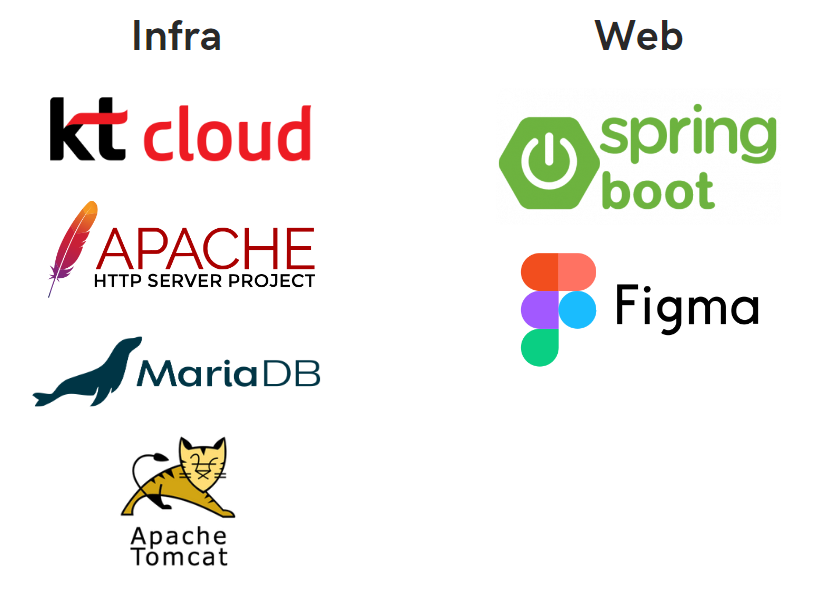
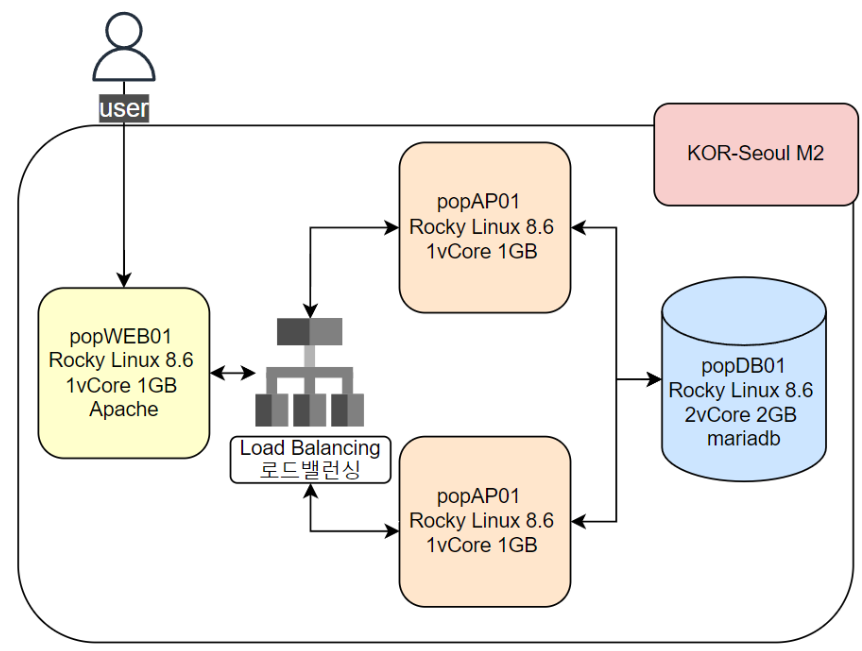

# 풍요로운한국 - 돕고 사는 우리나라를 위한 프로젝트
경북소프트웨어고등학교 2023학년도 2학기 캡스톤프로젝트

### 팀장
  * [장수진](https://github.com/jsj08113) - 프론트엔드 개발, 프로젝트 발표

### 팀원
  * [정찬빈](https://github.com/icerice06) - 프론트엔드 개발
  * [이태우](https://github.com/taiyu0209) - 백엔드 개발
  * [홍윤성](https://github.com/fuzzy0260) - 클라우드 인프라 구축

## 구현 형태
  * 공공의 이익을 위한 지역 홍보 서비스
  * 로드밸런싱을 활용해 큰 부하에 대비
  * 서버 장애 시 빠른 대처를 위해 모니터링 시스템 구축
  * 설명이 필요 없는 직관적인 UI

## 개발 스택
  

## 웹 디자인
  * [디자인 시안](./design/)

## 구상도
  

## 일지

  * [일지](./docs/)
